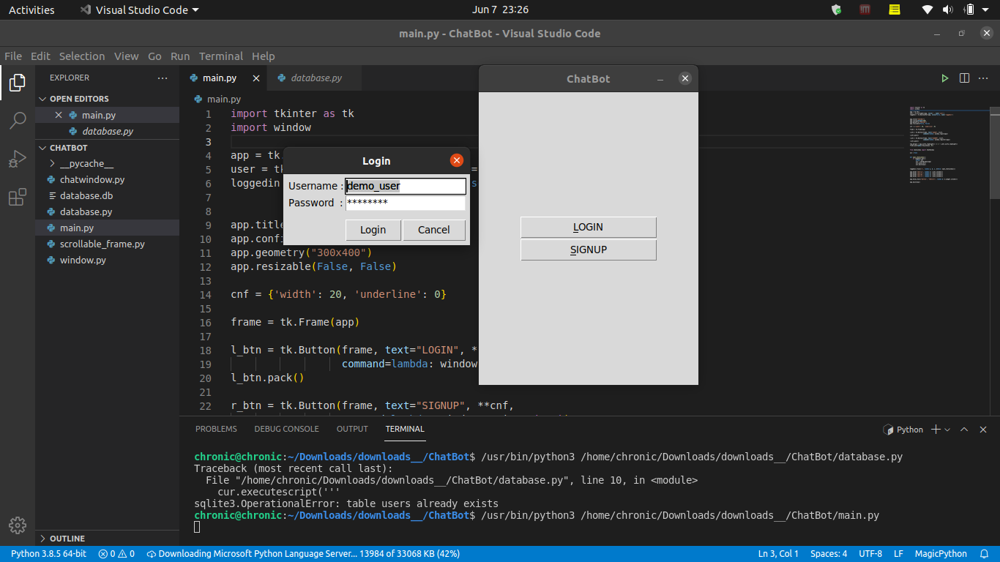
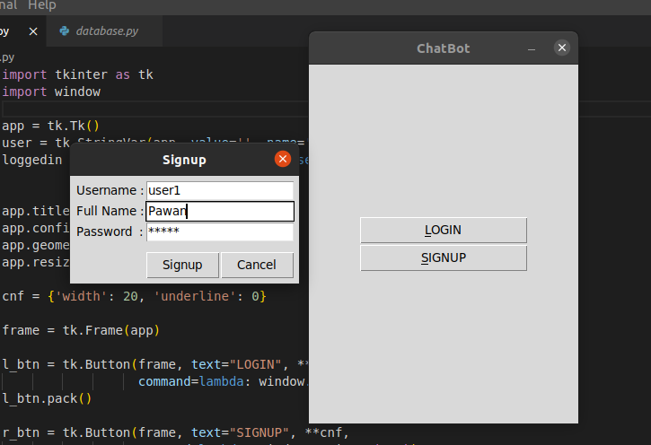
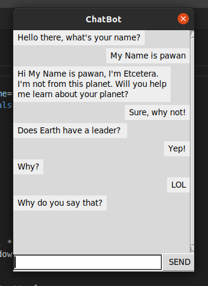

## Rule Based Chatbot

A rule based simple chatbot designed on the motivation of handling customers in a real world, mostly you can't hire a bunch a people to respond to every queries that customer might ask, so we have chatbot for common FAQs.

### At a glance.

Home Screen

Sign up Screen

Chat Screen

#### Built with:

> Python
> Sqlite3
> Tkinter

##### How to run?

> `git clone https://github.com/hakpk5/Rule-Based-Chatbot.git Run database.py, and then run main.py`

###### Things to have beforehand.

1.  Install python3 or above
2.  Intall tkinter
3.  Install sqlite3
